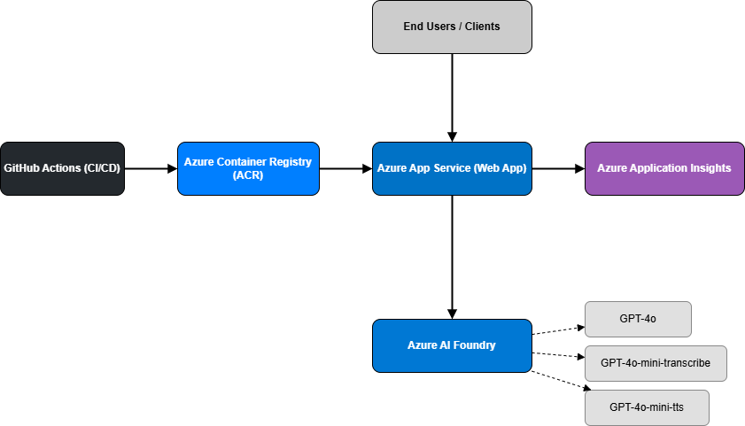

## Voice Agent (ASR → LLM → TTS)

Servicio FastAPI que recibe audio (.wav/.mp3), lo transcribe (ASR directo a Azure), analiza el texto con un LLM (LangChain + Azure OpenAI) y devuelve audio sintetizado (TTS con Azure), junto con un JSON con la transcripción y la respuesta textual.

### Características
- ASR: consumo directo del endpoint de Azure OpenAI Audio Transcriptions (multipart: model + file).
- NLP: LangChain con `AzureChatOpenAI` (deployment configurable).
- TTS: consumo directo del endpoint de Azure OpenAI Audio Speech (JSON body: model, input, voice).
- Observabilidad: logging estructurado, `x-request-id` en todas las respuestas, y soporte opcional para Application Insights (Azure Monitor).
- Manejo de errores: respuestas consistentes con `{"detail": "..."}` y códigos HTTP 4xx/5xx apropiados.
- FastAPI con OpenAPI/Swagger.
- Dockerfile para contenedorización.
- CI/CD: workflow de GitHub Actions para construir y desplegar contenedor a Azure Web App (container).

### Arquitectura (alto nivel)


```
Audio (.wav/.mp3) → [ASR REST] → Texto → [LLM LangChain + Azure OpenAI] → Respuesta texto → [TTS REST] → Audio (base64)
```


## Decisiones y justificación
- **3 modelos (ASR, LLM, TTS):** se eligió separar las capacidades para demostrar la integración de cada servicio de Azure (transcripción, generación y síntesis). Alternativamente, se podría simplificar con un único modelo multimodal (p. ej., GPT-4o) que procese audio de entrada y devuelva texto/audio, reduciendo latencia y complejidad operativa, a costa de menor control por etapa.
- **Docker + GitHub Actions:** se usan para garantizar CI/CD reproducible. La imagen se construye siempre igual localmente y en el pipeline, y se despliega a Azure App Service (contenedor) desde ACR.
- **Ecosistema Azure:** se usa Azure OpenAI/Audio (Azure AI Foundry) para cumplir con requisitos de seguridad y cumplimiento, integración nativa con redes privadas, identidades administradas y observabilidad (Application Insights).
- **Endpoint `/health`:** permite monitoreo básico de liveness en App Service. Responde `{ "status": "ok" }` con baja latencia.
- **Pruebas unitarias:** existen tests mínimos (salud y flujo de voz con stub) para verificar que la aplicación arranca y que el endpoint principal responde con el contrato esperado.
- **Pydantic (pydantic-settings):** centraliza la configuración por variables de entorno, con tipos por campo y validaciones simples, facilitando cambios entre entornos sin modificar código.
- **Funciones asíncronas:** las llamadas a servicios externos (ASR/NLP/TTS) se realizan con `httpx` asíncrono para no bloquear el event loop y mejorar latencia bajo carga.
- **Logging:** se implementó logging estructurado a consola, middleware de `x-request-id` para correlación, y  registro en Application Insight. Se añadieron handlers globales para devolver errores consistentes (422/500) y logs de excepción.

## Próximos pasos para desplegar la solución real
- **Key Vault:** Almacenar y rotar secretos (claves y connection strings) para garantizar la seguridad de la información.
- **Autenticación/Autorización:** proteger el frontend y el backend (por ejemplo, Azure AD/Entra ID o tokens) para controlar acceso al endpoint `/v1/voice` y a la UI.
- **Azure Monitor avanzado**: contar con dashboards, alertas (métricas de latencia/errores), trazas end-to-end (FastAPI + llamadas externas).


### Ejemplo de consumo de la API
```powershell
curl -X POST "https://savanttest-ctf4a9cnabejamcf.canadacentral-01.azurewebsites.net/v1/voice" -H "accept: application/json" -H "Content-Type: multipart/form-data" -F "file=@C:\ruta\a\tu\audio.mp3;type=audio/mpeg"
```
Respuesta esperada (200):
```json
{
  "transcription": "...",
  "response_text": "...",
  "audio_mime_type": "audio/mpeg",
  "audio_b64": "..."
}
```

### Documentación y Swagger
- Local: http://localhost:8000/docs (Swagger) | http://localhost:8000/redoc
- Producción: [Swagger](https://savanttest-ctf4a9cnabejamcf.canadacentral-01.azurewebsites.net/docs) [OpenAPI](https://savanttest-ctf4a9cnabejamcf.canadacentral-01.azurewebsites.net/redoc)


### Estructura de carpetas
- `app/`
  - `app.py` — App FastAPI, CORS, health, request-id middleware, handlers globales.
  - `config.py` — Variables de entorno (pydantic-settings).
  - `routers/voice.py` — Endpoint POST `/v1/voice` (pipeline ASR → LLM → TTS).
  - `services/`
    - `asr.py` — Azure Audio Transcriptions (REST, multipart).
    - `nlp.py` — LLM con LangChain + AzureChatOpenAI.
    - `tts.py` — Azure Audio Speech (REST, binario → base64).
- `tests/` — Pruebas (salud y flujo de voz con stub).
- `.github/workflows/main_savanttest.yml` — Build+Push a ACR y deploy a Azure Web App container.
- `Dockerfile` — Imagen lista para producción.

### Requisitos
- Python 3.11+
- Variables de entorno en `.env` (no lo subas al repo)

## Configuración (.env)
Variables principales por componente (usa valores propios):

### General (LLM)
- `AZURE_OPENAI_API_KEY=<clave>`
- `AZURE_INFERENCE_ENDPOINT=<url-completo>`: URL de inferencia de Azure OpenAI que se usa como `azure_endpoint` en LangChain. Ejemplo:
  `https://<resource>.cognitiveservices.azure.com/openai/deployments/<deployment>/chat/completions?api-version=2025-01-01-preview`
- `AZURE_OPENAI_DEPLOYMENT=<nombre>` (opcional): nombre del deployment usado por LangChain (si procede).
- `LLM_MODEL=gpt-4o` (opcional)
- `LLM_TEMPERATURE=0.3` (opcional)
- `LLM_MAX_TOKENS=1024` (opcional)
- `PROMPTS_VERSION=v1` (opcional)

### ASR (Audio Transcriptions)
- `AZURE_AUDIO_TRANSCRIBE_ENDPOINT=https://<resource>.cognitiveservices.azure.com/openai/deployments/<deployment>/audio/transcriptions?api-version=<ver>`
- `AZURE_AUDIO_TRANSCRIBE_MODEL=gpt-4o-mini-transcribe`
- `AZURE_AUDIO_API_KEY=<clave>` (si falta, se reutiliza `AZURE_OPENAI_API_KEY`)

### TTS (Audio Speech)
- `AZURE_TTS_ENDPOINT=https://<resource>.cognitiveservices.azure.com/openai/deployments/<deployment>/audio/speech?api-version=<ver>`
- `AZURE_TTS_MODEL=gpt-4o-mini-tts`
- `AZURE_TTS_API_KEY=<clave>` (si falta, se reutiliza `AZURE_OPENAI_API_KEY`)
- `TTS_VOICE=alloy`

### Observabilidad
- `APPLICATIONINSIGHTS_CONNECTIONSTRING=InstrumentationKey=...;IngestionEndpoint=...;...`
  - Se configura Azure Monitor (Application Insights) automáticamente.

## Ejecutar localmente
1) Crea `.env` con tus valores.
2) Instala dependencias y arranca el servidor:

```powershell
python -m pip install -r requirements.txt
python .\main.py
```

## API
### GET `/health`
Respuesta mínima para sondeo de estado:
```json
{"status": "ok"}
```

### POST `/v1/voice`
Multipart form-data:
- `file` (audio `.wav`, `.mp3`)

Ejemplo (PowerShell):
```powershell
curl -X POST "http://localhost:8000/v1/voice" -H "accept: application/json" -H "Content-Type: multipart/form-data" -F "file=@C:\ruta\a\tu\audio.mp3;type=audio/mpeg"
```

Respuesta (200):
```json
{
  "transcription": "...",
  "response_text": "...",
  "audio_mime_type": "audio/mpeg",
  "audio_b64": "..."
}
```

Errores (ejemplos):
- 400: `{"detail":"Formato de audio no soportado"}`
- 422: `{"detail":"Solicitud inválida: datos no válidos"}`
- 502: `{"detail":"Error procesando audio o generando respuesta"}`

Todas las respuestas incluyen la cabecera `x-request-id` para correlación en logs y Application Insights.

UI de prueba (grabación en el navegador): abre `http://localhost:8000/` y usa los botones Start/Stop/Send. También disponible en `http://localhost:8000/frontend`.


## Pruebas
Ejecuta los tests con Python del entorno virtual:
```powershell
.venv\Scripts\python.exe -m pytest -q
```

## Docker
Construcción y ejecución local:
```powershell
docker build -t voice-agent .
docker run -p 8000:8000 --env-file .env voice-agent
```

## CI/CD (Azure Web App – contenedor)
Workflow: `.github/workflows/main_savanttest.yml`
- Buildx, login a ACR, `docker build-push`, y despliegue a Azure Web App (container) con `azure/webapps-deploy@v2`.
- Requiere secretos configurados en el repositorio (credenciales de ACR y publish profile del Web App).
